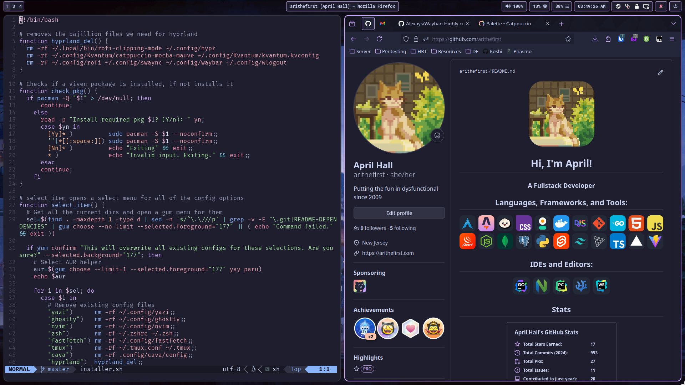

# Hyprland

[Wallpaper Switcher Script](https://www.youtube.com/watch?v=6euidiSWaKM) - [Workspace Switch Animation](https://www.youtube.com/watch?v=fyRkQ3hKVE4)


> [!NOTE]
> You will need to **manually update** the following files and substitue `ari` for your linux username.
> - [`.config/rofi/config.rasi`](https://github.com/arithefirst/dotfiles/blob/6d81b2bb4f1ff448a3789ed65b3df6eb49071da4/hyprland/.config/rofi/config.rasi#L10) (Line 10)
> - [`.config/hypr/hyprland.conf`](https://github.com/arithefirst/dotfiles/blob/6d81b2bb4f1ff448a3789ed65b3df6eb49071da4/hyprland/.config/hypr/hyprland.conf#L27) (Line 27)

<details>
<summary><h2>Binds</h2></summary>

### Keybinds

- <KBD>MOD</KBD> + <KBD>C</KBD>: Close focused window
- <KBD>MOD</KBD> + <KBD>E</KBD>: Open file explorer
- <KBD>MOD</KBD> + <KBD>F</KBD>: Toggle floating
- <KBD>MOD</KBD> + <KBD>K</KBD>: Enter force-kill mode
- <KBD>MOD</KBD> + <KBD>M</KBD>: Exit hyprland
- <KBD>MOD</KBD> + <KBD>R</KBD>: Open launcher (rofi)
- <KBD>MOD</KBD> + <KBD>S</KBD>: Take screenshot of a window
- <KBD>MOD</KBD> + <KBD>V</KBD>: Show clipboard
- <KBD>MOD</KBD> + <KBD>W</KBD>: View all open windows
- <KBD>MOD</KBD> + <KBD>ENTER</KBD>: Open terminal
- <KBD>MOD</KBD> + <KBD>UP-ARROW</KBD>: Move focus up
- <KBD>MOD</KBD> + <KBD>DOWN-ARROW</KBD>: Move focus down
- <KBD>MOD</KBD> + <KBD>LEFT-ARROW</KBD>: Move focus left
- <KBD>MOD</KBD> + <KBD>RIGHT-ARROW</KBD>: Move focus right
- <KBD>MOD</KBD> + <KBD>{Number 0-9}</KBD>: Switch to workspace {Number 0-9}

- <KBD>ALT</KBD> + <KBD>SHIFT</KBD> + <KBD>S</KBD>: Open wlogout (Power Menu)

- <KBD>MOD</KBD> + <KBD>SHIFT</KBD> + <KBD>C</KBD>: Open colorpicker
- <KBD>MOD</KBD> + <KBD>SHIFT</KBD> + <KBD>S</KBD>: Take screenshot of a region

- <KBD>MOD</KBD> + <KBD>SHIFT</KBD> + <KBD>HOME</KBD>: Take screenshot of a screen
- <KBD>MOD</KBD> + <KBD>SHIFT</KBD> + <KBD>{Number 0-9}</KBD>: Move focused window to workspace {Number 0-9}

### Mousebinds

- <KBD>Hover over window</KBD>: Focus hovered window
- <KBD>MOD</KBD> + <KBD>SCROLL</KBD>: Scroll through workspaces
- <KBD>MOD</KBD> + <KBD>LEFTCLICK</KBD> + <KBD>Drag Mouse</KBD>: Move window
- <KBD>MOD</KBD> + <KBD>SHIFT</KBD> + <KBD>LEFTCLICK</KBD> + <KBD>Drag Mouse</KBD>: Resize window
- <KBD>POPMOUSE ACTION BUTTON</KBD>: Open launcher (rofi) (this only works on a Logi Popmouse)
</details>

## Dependencies

- apple_cursor
- cliphist
- Ghostty
- hyprland suite
  - hypridle
  - hyprland
  - hyprpicker
  - hyprshot
- pavucontrol
- rofi (wayland)
- swaync
- swww (git)
- roboto mono nerd font
- nautilus
- tumbler
- waybar
- wlogout

## Install Command

```shell
# On Arch Linux
yay -S apple_cursor cliphist ghostty \
hypridle hyprland hyprpaper \
hyprpicker hyprshot pavucontrol \
rofi-wayland swaync swww-git \
ttf-roboto-mono-nerd nautilus \
tumbler waybar wlogout \
```
## GTK Theming

For GTK Theming, I reccomend using nwg-look to install Catppuccin Mocha Mauve Styles. To adhere to the theme that I have setup for my rice, follow the steps below.

1. Run `yay -S nwg-look catppuccin-gtk-theme-mocha`
2. Run `nwg-look` from your terminal, or launch it from your app launcher
3. Select "catppuccin-mocha-mauve-standard+default"
4. Click Apply

## QT6 Theming

For QT6 Theming, I reccomend using Kvantum to install Catppuccin Mocha Mauve Styles. To adhere to the theme that I have setup for my rice, follow the steps below.

1. Run `yay -S kvantum`
2. Run `stow hyprland` from the root dotfiles directory
3. Kvantam themes should be applied
